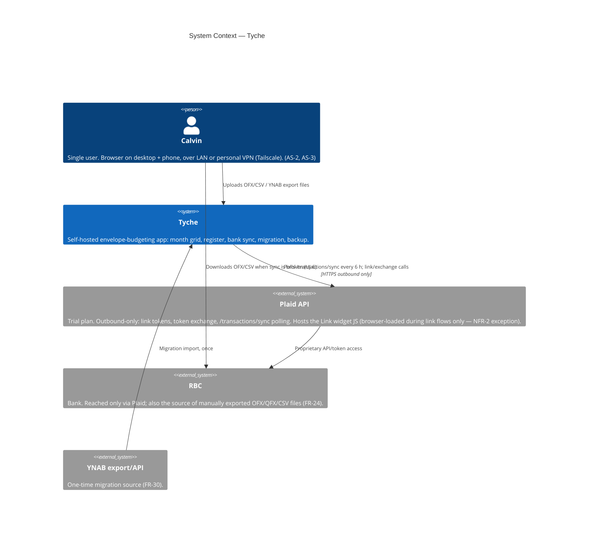
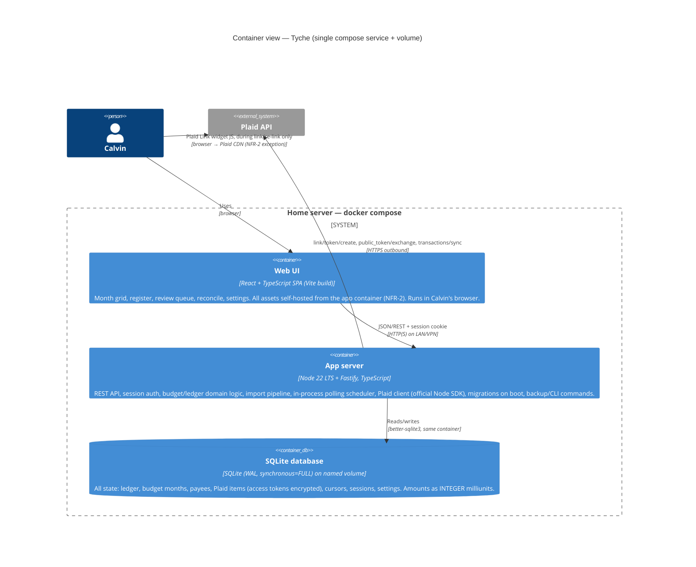
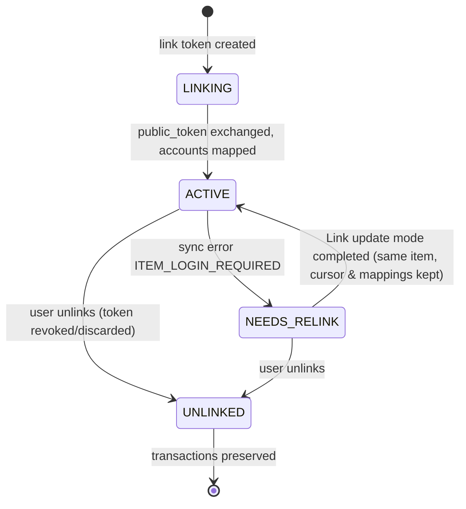

# Architecture: Tyche — a Self-Hosted YNAB-Style Budgeting App

| | |
|---|---|
| **Status** | Proposed — for Gate 2 (Solutioning) review by Calvin |
| **Author** | full-stack-architect (claude-toolkit SDLC) |
| **Date** | 2026-06-12 |
| **Inputs** | `docs/prd.md` (Approved, Gate 1 2026-06-12), `docs/analysis/plaid-feasibility.md`, `docs/analysis/ynab-usage.md` |
| **Decisions** | ADR-001 … ADR-008 in `docs/adr/` |
| **Downstream** | Story decomposition (spec-driven-development) |

One sentence: a **single-container TypeScript modular monolith** (Node/Fastify + React SPA, SQLite on a Docker volume), with an in-process import subsystem that feeds Plaid sync and OFX/CSV files through one normalize → match → review pipeline, and budget math recomputed from raw rows on every read.

---

## 1. Driving architecture characteristics

Derived from the PRD's NFRs; everything else is explicitly *not* a driver (no scalability, no elasticity, no multi-tenancy — NG-1, NG-5). Seven, each measurable:

| # | Characteristic | Measure | Source |
|---|---|---|---|
| C1 | **Deployability** | One `docker compose up -d`; first run ≤ 30 min; no inbound URL | NFR-5 |
| C2 | **Resource efficiency** | ≤ 1 GB RAM, ≤ 5% avg CPU, ≤ 1 GB disk/year | NFR-6 |
| C3 | **Data residency / privacy** | Outbound = Plaid API only; zero CDN/telemetry at runtime (Link-flow exception); secrets encrypted at rest | NFR-2, NFR-3 |
| C4 | **Interactive performance** | Month grid & register < 1 s at 10k txns; edits < 200 ms perceived; keyboard-driven | NFR-1, NFR-9 |
| C5 | **Durability / recoverability** | Zero acknowledged-write loss on hard kill; backup = single artifact, one command; RPO ≤ 24 h, RTO ≤ 1 h | NFR-7, FR-35 |
| C6 | **Correctness / auditability** | Exact decimal math; every displayed balance recomputable from raw rows; built-in consistency check | FR-32, NFR-12 |
| C7 | **Solo maintainability** | One person owns it; ops ≤ 30 min/month; `pull && up -d` upgrades with auto-migrations | SM-4, NFR-11 |

Tensions to manage: C4 (snappy aggregates) vs C6 (no trusted caches) — resolved in ADR-005; C3 (no CDN) vs Plaid Link being CDN-hosted — resolved by the PRD's own carve-out (NFR-2) and scoped in §6; C7 (boring, few moving parts) dominates every tie-break.

## 2. Architecture style — modular monolith, one quantum (ADR-001)

The honest analysis, not the reflex: any **distributed style** (microservices, service-based, event-driven with a broker) buys deployability-per-service, independent scaling, and fault isolation — none of which appear in the driver list — and pays for it in containers, RAM, and ops burden, which directly violates C1/C2/C7. The fallacies-of-distributed-computing tax has no payer here: one user, one host, one developer. A **layered monolith** would also satisfy C1/C2 but ages badly for C7: the import subsystem (FR-25) and budget engine have genuinely different change cadences and the PRD demands a hard seam between them (FR-25: budget math independent of transaction provenance).

**Decision:** a **modular monolith** — single deployable process (one architecture quantum), internally partitioned by *domain*, with one microkernel-flavoured seam: the importer port with pluggable backends (Plaid, OFX/CSV file, YNAB migration). Trade-off accepted: no independent deployment of the importer; a crash anywhere restarts everything (acceptable under NFR-8's 99%/auto-restart posture).

Internal modules (enforced by directory + lint boundaries, not processes):

```
app/
├─ budget/        # categories, groups, monthly assignments, RTA, rollover (FR-1..9)
├─ ledger/        # accounts, transactions, splits, transfers, clearing, reconcile, payees (FR-10..19)
├─ importing/     # pipeline + scheduler + backends: plaid/, filefmt/, ynab-migration/ (FR-20..31)
├─ auth/          # session login, rate limit, password (FR-33, NFR-10)
├─ admin/         # settings, backup/restore, CSV export, consistency check (FR-34..36, NFR-12)
└─ web/           # HTTP layer (REST) + serves the SPA bundle
```

Rule: `importing` writes to `ledger` only through the same command interface the UI uses; `budget` reads `ledger` rows and `budget` assignments — it never knows a transaction's source (FR-25).

## 3. C4 Context



No inbound connections from the internet — polling only (NFR-4, AS-7); no webhook endpoint exists.

## 4. C4 Container



One service, one volume. The "SPA" is not a separate deployable — it's static files served by the app server. SQLite is in-process — there is no database container (ADR-003). Total: **one container**, comfortably under 1 GB (typical Node + SQLite footprint: 100–250 MB at this data volume).

## 5. Domain model & budget math

### Entities (conceptual)

- **Account** — name, type (`chequing|savings|tracking`), `on_budget` flag, starting balance, open/closed (FR-10..12). Cash semantics only (NG-3, OQ-6).
- **Transaction** — account, date, payee, memo, **amount in integer milliunits** (signed; ADR-004), status (`uncleared|cleared|reconciled`), `approved` flag, import metadata (`source: manual|plaid|file|migration`, `import_id`, import batch). A transaction is either categorized directly, **split** into lines (child rows that must sum to the parent — FR-15), or one side of a **transfer**.
- **Transfer** — modeled as **two paired transaction rows** sharing a `transfer_id`; edits/deletes cascade to the pair (FR-16). On-budget↔on-budget: no category; on-budget↔tracking: the on-budget side carries the category.
- **CategoryGroup / Category** — ordered, hidable; deletion of a category with history requires a reassignment target (FR-9). Two system categories: *Inflow: Ready to Assign* and *Reconciliation adjustment*.
- **MonthAssignment** — `(category, month) → assigned_milliunits`, the only stored budget input besides transactions (FR-1, FR-4); a category-to-category move (FR-5) is a paired assignment adjustment within the month.
- **Payee** — canonical name + last-used category for suggestion (FR-19).
- **PlaidItem** — institution, encrypted `access_token`, `cursor`, status (state machine §6), account mappings, sync-attempt log (FR-20, FR-26..28).
- **ImportBatch / MatchCandidate** — provenance and the review/unmatch trail (FR-22, FR-23).

### Budget math (the formulas the system trusts)

All derived, none stored (ADR-005):

- `activity(c, m)` = Σ amounts of approved-or-not transaction lines categorized to `c` dated in month `m`, on-budget accounts only. Tracking-account rows never enter this sum (FR-10).
- `available(c, m)` = `carryover(c, m) + assigned(c, m) + activity(c, m)` (FR-1), where
  `carryover(c, m)` = `max(0, available(c, m−1))` — **AS-1 cash rule**: negatives do not carry in the category (FR-8).
- `overspend_deduction(m)` = Σ over categories of `min(0, available(c, m−1))` — the prior month's cash overspends, charged to this month's RTA (AS-1).
- `RTA(m)` = Σ inflows-to-RTA in months ≤ m − Σ assigned across **all** months ≤ m − Σ cumulative overspend deductions ≤ m (FR-3). May be negative → warn, never block (FR-6, FR-7).

“Month rollover” (UJ-7) is therefore **not an event** — there is no rollover job and nothing to run at midnight on the 1st; it falls out of the recurrence above. This kills an entire class of state-corruption bugs and makes NFR-12's consistency check almost a tautology (it still exists, as a cross-check of the SQL aggregation vs an independent in-memory recompute).

Performance check against C4: at the PRD ceiling (10k transactions, 40 categories, 60 months) the month grid needs one `GROUP BY category, month` over an indexed table plus a 60-iteration fold for carryover/RTA — single-digit milliseconds in SQLite. NFR-1's <1 s has ~two orders of magnitude headroom; <200 ms edits are an `UPDATE` + one recompute. If the dataset ever grows 100×, ADR-005 names the escape hatch (materialized month cache) — not built now.

## 6. Import subsystem (FR-20..31)

### The importer port

One interface, three backends (ADR-006). Every backend emits the same `StagedTransaction` shape (account-mapping hint, date, payee string, amount milliunits, external id, raw payload); everything downstream is shared:

```
Plaid /transactions/sync ─┐
OFX/QFX/CSV file upload  ─┼─► normalize ─► dedup & match (FR-23) ─► review queue (FR-22) ─► ledger
YNAB migration (FR-30)   ─┘                                          (approve/edit/reject)
```

- **Normalize** — parse, sign-correct, map to app account, canonicalize payee (suggest last-used category, FR-19).
- **Dedup & match** — tier 1: exact `external_id` (Plaid `transaction_id`, OFX `FITID`) already seen → apply as update or skip. Tier 2: heuristic match against unmatched register rows — same account, exact amount, date within ±5 days → merge with the existing row (manual entry meets its bank copy), preserving the user's category/memo and attaching the import identity; user-visible unmatch undoes the merge (FR-23). Tier 3: no match → new unapproved row.
- **Review queue** — unapproved transactions, visibly distinct, editable without losing imported amount/date (FR-22). Plaid `removed` events void/remove unapproved rows and flag approved ones for user attention (FR-21).
- **Migration backend** — YNAB export/API → same pipeline with approval pre-set, plus assignments per month; idempotent into an empty budget; emits a discrepancy report; gated by the FR-30 to-the-cent parity check (ADR — covered in risk R3, no separate ADR: it's a pipeline backend, not a new structure).

FR-25 is enforced structurally: the budget module cannot see `source`.

### Polling scheduler (NFR-4)

In-process timer inside the app server — **no external cron, no extra container** (C1/C2). Default 6 h, configurable at runtime via settings (FR-34); persists `next_run_at` so a restart doesn't skip or stampede; manual "sync now" enqueues the same job; every attempt logs to the per-item sync-health log (FR-27).

### Item state machine (FR-26, FR-28)



`NEEDS_RELINK` drives the persistent banner with last-success time (FR-26); polling pauses for that item; update mode does not re-map accounts.

### Secrets at rest (NFR-3, ADR-007)

Plaid `access_token`s and the Plaid client secret are encrypted with **AES-256-GCM** before touching SQLite; the data-encryption key comes from the compose `.env` (`MASTER_KEY`, generated at first run) — never stored in the DB or the backup artifact. Tokens are redacted from logs at the logging-layer level. Consequence (accepted, matches FR-35): a restore onto a new host without the `.env` resumes everything except sync, which needs at most a re-link.

## 7. API & auth (ADR-008)

- **API shape: REST** (plain JSON over Fastify routes) with the OpenAPI-described contract and shared TypeScript types end-to-end. RPC/tRPC was the runner-up — rejected for coupling the API's lifetime to one client framework; REST keeps the CSV-export/scripting/backup surface curl-able (JTBD-4) at near-zero extra cost for a ~30-endpoint API.
- **Rendering: SPA** (React + Vite, all assets served from the app container — no CDN, no third-party fonts, NFR-2). The month grid and register are YNAB-grade interactive surfaces — keyboard-driven cell editing, optimistic <200 ms updates, virtualized register rows (NFR-1/9). That's CSR territory; SSR/SSG buy SEO and first-paint for public content, and this app has neither (auth-gated, LAN, NG-5). Server state via TanStack Query with optimistic mutation + reconciliation against the server-recomputed balances (the server's numbers always win — C6).
- **Plaid Link exception:** the Link JS widget is loaded from Plaid's CDN **only on the connection-management screens during link/re-link**, exactly the NFR-2 carve-out. No other page references any third-party origin; verifiable by the NFR-2 network-capture test.
- **Auth: server-side session, cookie-based** (NFR-10): single user, argon2id password hash, opaque session id in an `HttpOnly` + `SameSite=Lax` cookie, sessions in SQLite, 30-day configurable idle expiry, in-app login rate limiting (5 failures → 60 s lockout). No JWT (nothing to federate, no second service), no OAuth (no IdP on a LAN). Every API route requires the session (FR-33); CSRF covered by SameSite + custom-header check on mutations. TLS is delegated to the trust boundary per AS-2 — LAN, or Tailscale (which encrypts end-to-end); an optional reverse-proxy snippet is documented, not shipped.

## 8. Deployment view (C1, C5, NFR-11)

```yaml
# docker-compose.yml (shape, not final)
services:
  app:
    image: ghcr.io/cference/tyche:${VERSION:-latest}
    ports: ["8080:8080"]          # LAN only; no port-forwarding
    env_file: .env                # MASTER_KEY, PLAID_CLIENT_ID/SECRET (or set via UI), TZ
    volumes: ["data:/data"]       # data/app.db (+WAL), data/backups/
    restart: unless-stopped       # NFR-8 self-recovery
volumes:
  data:
```

- **Boot sequence:** run pending schema migrations (forward-only, versioned) → integrity/consistency check → start HTTP + scheduler. NFR-11's "never silently alters historical balances" is enforced by a balance checksum recorded before and verified after every migration.
- **Backup (FR-35):** `docker compose exec app tyche backup` → SQLite `VACUUM INTO` snapshot + settings manifest, packed into one timestamped `.tar.gz` in `data/backups/` — a single artifact, one command, safe while the app runs. **Restore:** `tyche restore <artifact>` on a stopped app. Off-host copying is Calvin's job pending OQ-7 (NFR-2 constrains any built-in push anyway). Daily backup = host cron or the in-app scheduler's daily job (RPO ≤ 24 h).
- **Durability:** WAL mode with `synchronous=FULL` — an acknowledged commit survives kill -9 and power loss (NFR-7). Cost is per-commit fsync, irrelevant at single-user write rates.
- **Upgrade:** `docker compose pull && docker compose up -d`; image entrypoint takes an automatic pre-migration backup first.

## 9. Risk storm (impact × likelihood, 1–9)

| # | Risk | I×L | Score | Mitigation |
|---|---|---|---|---|
| R1 | **RBC↔Plaid link breakage** (`ITEM_LOGIN_REQUIRED`, RBC auth-flow churn) | M×H | 6 | Treated as an operating condition, not a defect (AS-10): re-link state machine + banner (FR-26), sync-health log (FR-27), and the file importer is a *first-class* backend of the same pipeline, not a bolt-on — recovery ≤ 15 min (SM-3). |
| R2 | **Plaid Trial doesn't pan out** — RBC on the excluded list (OQ-2), plan terms change, or pricing surprises | H×M | 6 | OQ-2 dashboard check **before any sync story is scheduled** (PRD gate condition). Architecture is pre-hedged: ADR-006's port means "file import becomes primary" is a scheduling change, not a redesign; ~90-day RBC export window sets the import cadence floor. |
| R3 | **Migration fidelity** — YNAB history doesn't reproduce balances to the cent | H×M | 6 | Milliunits natively match YNAB's storage (ADR-004, zero conversion loss); idempotent re-runnable importer + discrepancy report (FR-31); automated parity check on migration day (FR-30) and the one-month parallel run (SM-1) as the release gate. |
| R4 | **Money-math correctness** — RTA/rollover edge cases silently wrong | H×L | 4 | Integer-only arithmetic (ADR-004); single recompute path, no stored aggregates to drift (ADR-005); property-based tests on FR-1/FR-3/FR-8 invariants; NFR-12 consistency check runs at boot and on demand. |
| R5 | **Solo-maintainer bus factor / abandonment** — Calvin in 3 years inherits Calvin-now's choices | M×H | 6 | Boring, single-language stack with huge communities (ADR-002); one container, one file DB (ADR-001/003); minimal dependency surface, pinned + lockfiled; ADRs record *why*; CSV export (FR-36) + SQLite file = data hostage-proof even if the app dies. |

**Prototype to de-risk first:** (a) Plaid sandbox spike through link → exchange → sync → `ITEM_LOGIN_REQUIRED` simulation (R1/R2, after OQ-2); (b) month-grid keyboard-editing spike with seeded 10k-transaction data to validate the <200 ms feel before committing to grid component choices (C4).

## 10. ADR index

| ADR | Decision |
|---|---|
| [ADR-001](adr/ADR-001-modular-monolith-single-container.md) | Modular monolith, one container, one quantum |
| [ADR-002](adr/ADR-002-typescript-node-react-stack.md) | TypeScript end-to-end: Node 22 + Fastify, React + Vite SPA |
| [ADR-003](adr/ADR-003-sqlite-datastore.md) | SQLite (WAL, synchronous=FULL) as the only datastore |
| [ADR-004](adr/ADR-004-money-integer-milliunits.md) | Money as integer milliunits (CAD) |
| [ADR-005](adr/ADR-005-recompute-on-read-budget-math.md) | Recompute budget aggregates on read; no stored aggregates |
| [ADR-006](adr/ADR-006-importer-port-and-in-process-scheduler.md) | Importer port with pluggable backends; in-process polling scheduler |
| [ADR-007](adr/ADR-007-secrets-encryption-and-key-management.md) | AES-256-GCM field encryption; master key in `.env`, outside DB & backups |
| [ADR-008](adr/ADR-008-rest-api-session-auth-spa.md) | REST API + cookie sessions + self-hosted SPA |

## 11. For Calvin at the gate

1. **ADR-002's load-bearing assumption:** you maintain this alone for years — is **TypeScript/Node/React** the stack you want to be fluent in at 11 pm when sync breaks? If your honest answer is Python or Go, say so now; it changes ADR-002 only (the architecture survives).
2. **OQ-2 stands:** the 5-minute Plaid-dashboard check (RBC not Trial-excluded) blocks scheduling of all sync stories.
3. **OQ-7 (backup destination):** architecture assumes local artifact + you handle off-host copies; confirm.
4. Confirm you accept the ADR-007 consequence: lose the `.env` master key → restore works, but every bank connection needs a re-link.
